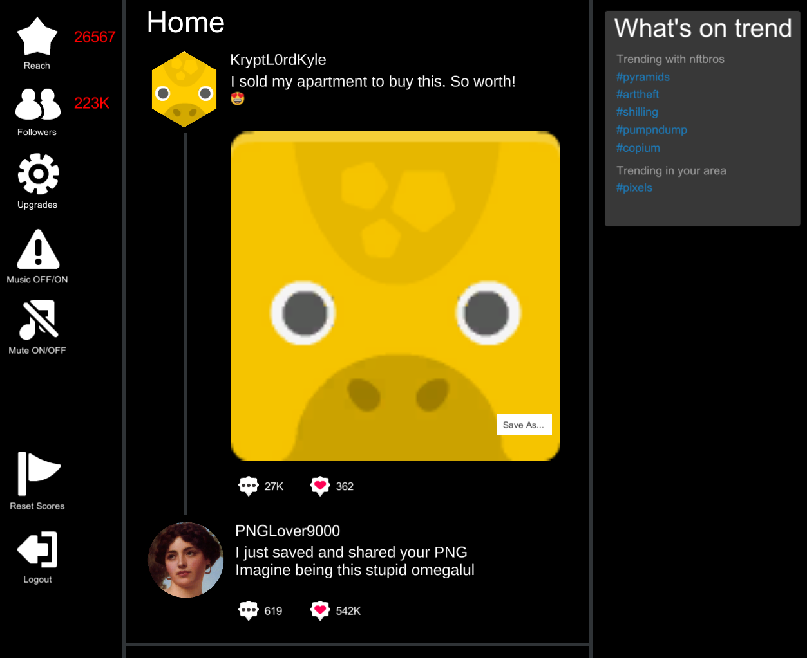

<!-- HEADER -->

  
# Unity-Joke-NFT-Clicker
A Unity clicker game poking fun at NFTbros and the whole initial NFT drama for a laugh.

  

<!-- BODY -->
## What?
This is a bit rough, and was thrown together in basically a night from some project leftovers for a giggle.

It's a mock social media platform clicker game in which you save peoples PNGs (click for resource/score) and build your reach and followers (score and multipliers) for doing so.

Uses some [Kenney](https://twitter.com/kenneynl?lang=en) images for the "NFTs". I'm so sorry Kenney 😂🙏🏻. I just needed some CC0 consistent profile style images!

## Features
* Randomized user names, twit body texts from the users and the players user and "NFT" images from a pool.
* Reach (score) in typical clicker game score fashion that is also used as a resource for buying score multipliers.
* Followers (silly representation for multipliers).
* Upgrades shop themed with the idea of the social media platform.
* Music mute and game mute.
* Score reset.
* TextMeshPro for emoji rendering.
* Single script manages the game and has a very basic scene hierarchy requirement.

<!-- BUY ME A COFFEE -->
## Help Support More Like This

<!-- LICENSE -->
## License

Distributed under the GNU General Public License v3. See `LICENSE.txt` for more information.
